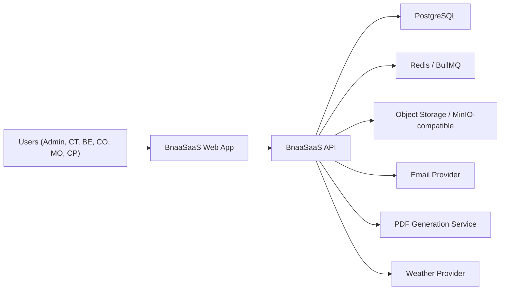
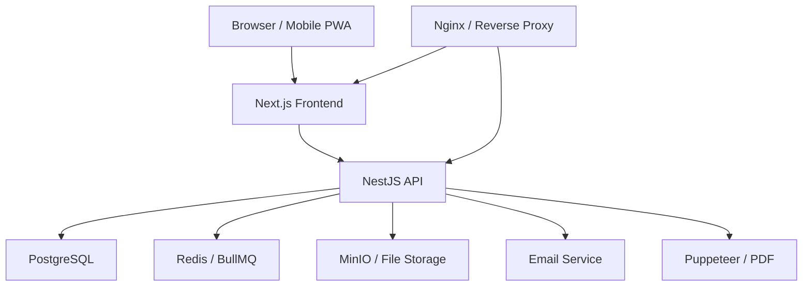
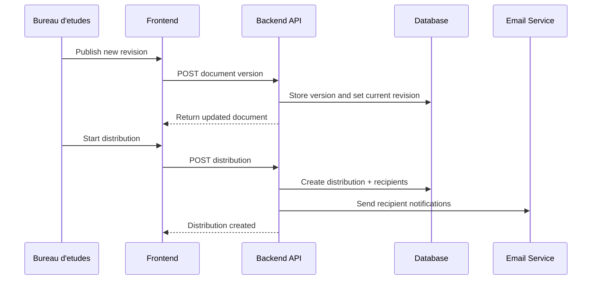
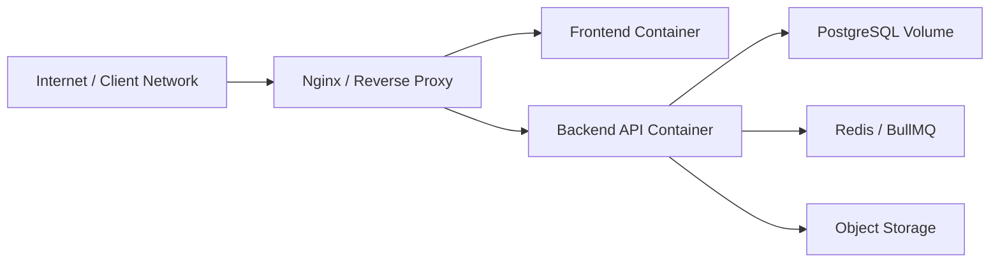

# BnaaSaaS Technical Infrastructure Documentation

## Purpose

This document defines the technical infrastructure documentation standard for BnaaSaaS.

It combines two documentation layers:

1. `Software Architecture Document (SAD)`
2. `Internal Documentation Repository`

The goal is to give developers, DevOps, technical leads, and internal teams a reliable technical blueprint for how the SaaS is built, deployed, secured, and operated without requiring them to reverse-engineer the source code.

This file should be maintained close to the codebase so architecture, infrastructure, and operating procedures stay synchronized with implementation reality.

---

## Objectives

The technical infrastructure documentation must:

- explain the overall system structure clearly
- document data models and service boundaries
- describe internal and external integrations
- document deployment topology and runtime environments
- document security posture and operational safeguards
- support onboarding of developers and internal teams
- reduce tribal knowledge and hidden infrastructure assumptions
- help audits, incident response, and production troubleshooting

---

## Documentation Set

### 1. Software Architecture Document (SAD)

The `SAD` is the technical blueprint of the product.

It should describe:

- system context
- modules and services
- backend and frontend responsibilities
- data storage strategy
- multi-tenant approach
- integrations
- deployment topology
- observability and security posture

### 2. Internal Documentation Repository

The internal documentation repository complements the `SAD`.

It should contain:

- operating procedures
- deployment runbooks
- environment specifications
- infrastructure conventions
- incident-response notes
- onboarding workflows
- support and troubleshooting guides

Together, these two layers ensure both:

- `how the system is designed`
- `how the team operates and supports it`

---

## Recommended Documentation Structure

```text
docs/
  technical-infrastructure-documentation.md
  software-architecture/
    system-context.md
    container-architecture.md
    component-architecture.md
    data-model.md
    integrations.md
    deployment-topology.md
    security-posture.md
  internal/
    onboarding.md
    environments.md
    deployment-runbook.md
    backup-and-restore.md
    incident-response.md
    support-workflows.md
    operational-checklists.md
```

This main file acts as the entry point and reference standard for the detailed documents that follow.

---

## Software Architecture Document (SAD)

## SAD Scope

The `SAD` must explain:

- what the system consists of
- how major parts interact
- where data lives
- how requests flow
- how access is controlled
- how the platform is deployed and operated

It must be understandable by:

- backend engineers
- frontend engineers
- DevOps / infrastructure engineers
- technical leads
- auditors or security reviewers

---

## SAD Core Sections

### 1. System Context

Describe the system at a business-technical level:

- what BnaaSaaS is
- who uses it
- what external systems it depends on
- what internal services it contains

Minimum content:

- business purpose
- user roles
- main bounded domains
- external providers

### 2. Container / Service Architecture

Describe the runtime building blocks:

- frontend application
- backend API
- database
- cache / queue
- object storage
- notification/email providers
- reverse proxy / ingress

Document:

- ownership of each container/service
- exposed ports
- internal-only services
- data persistence responsibilities

### 3. Component Architecture

Describe how the application is broken into modules.

For BnaaSaaS, this should include:

- auth
- tenants
- users
- projects
- site
- documents
- finance
- notifications
- storage
- PDF generation
- queue / jobs

Each component entry should explain:

- responsibility
- inputs / outputs
- dependencies
- owned data
- key APIs or events

### 4. Data Architecture

Describe:

- database technology
- multi-tenant strategy
- schema structure
- main entities
- indexing strategy
- file storage strategy
- backup and recovery expectations

This section should answer:

- where relational data lives
- where binary files live
- how tenants are isolated
- how data moves between modules

### 5. Integration Architecture

Document all internal and external integrations:

- auth/session flows
- email provider
- PDF generation
- object storage
- weather source
- queues/background jobs
- any future internal services

For each integration, specify:

- purpose
- protocol
- authentication method
- failure handling
- retry strategy
- SLA / operational expectations when relevant

### 6. Deployment Topology

Describe:

- local development topology
- staging topology if introduced later
- production topology
- Docker / Compose layout
- reverse proxy behavior
- environment variables
- volumes and persistent data
- scaling direction

### 7. Security Posture

Describe the current and intended security baseline:

- authentication model
- authorization model
- tenant isolation
- secret handling
- password handling
- cookie/token strategy
- rate limiting direction
- audit expectations
- incident response expectations

This section is especially important for:

- audits
- production readiness
- customer trust
- incident investigation

---

## Architecture and Diagram Standards

Visual documentation should live close to the code and be updated when architecture changes.

Recommended diagram types:

- `C4 Level 1`: System context
- `C4 Level 2`: Container diagram
- `C4 Level 3`: Component diagram for key domains
- sequence diagrams for critical flows
- deployment diagrams for environments

### Example System Context Diagram



### Example Container Diagram



### Example Sequence Diagram

`Publish -> Distribute -> Acknowledge`



---

## Data and Integration Specifications

## Data Flow Documentation Standard

Every major workflow should have a documented data flow.

At minimum, document:

- entry point
- service interaction
- stored records
- triggered side effects
- user-visible result

Recommended critical flows:

- login / refresh / logout
- project access resolution
- `RJC` create -> prepare PDF -> validate
- document publish -> distribute -> acknowledge
- statement / invoice -> validation -> payment

### Example Data Flow Template

```text
Flow Name:
Purpose:
Actors:
Input:
Validation Rules:
Primary Write Path:
Background Jobs:
Notifications:
Failure Modes:
Audit Events:
```

---

## Interface Contract Standard

For each API or integration, document:

- endpoint or interface name
- request method
- authentication requirement
- request shape
- response shape
- business rules
- rate limits if applicable
- error behavior

### Minimum API Contract Table

| Field | Description |
|---|---|
| `Route` | Public route path |
| `Method` | HTTP verb |
| `Auth` | Required auth/session/role |
| `Request` | Input DTO or body/query shape |
| `Response` | Returned payload shape |
| `Errors` | Main error states |
| `Rate limit` | If defined |
| `Side effects` | Notifications, jobs, file writes, audit records |

### Authentication and Rate Limit Notes

For each public API family, explicitly document:

- whether it uses cookie auth, bearer auth, or both
- token lifetime and refresh behavior
- required roles / scopes
- rate-limiting rules
- behavior when tenant/project access is missing

---

## SLA and Reliability Documentation

Where applicable, document service expectations such as:

- expected uptime
- acceptable response time ranges
- queue retry behavior
- mail delivery fallback behavior
- PDF generation timeout expectations
- object storage availability expectations

This does not need to be overly formal at MVP stage, but the team should still define baseline expectations.

---

## Deployment and Security Documentation

## Deployment Environments

Document each environment separately.

Recommended sections:

- purpose
- hostnames / domains
- exposed ports
- Docker services
- secrets location
- persistent volumes
- backup strategy
- monitoring approach

### Environment Template

```text
Environment:
Purpose:
Services:
Public Entry Points:
Persistent Data:
Secrets:
Scaling Notes:
Rollback Method:
Owner:
```

---

## Deployment Topology Content

Each deployment document should explain:

- how traffic enters the system
- where TLS terminates
- how frontend and backend are routed
- where the database is hosted
- where files are stored
- where job workers run
- how the app is restarted or redeployed
- how rollback is performed

### Example Deployment Topology Diagram



---

## Security Posture Documentation Standard

Security documentation should clearly cover:

- identity and session model
- authorization model
- tenant isolation
- secret storage and rotation
- logging and audit traces
- data protection
- dependency and image hygiene
- incident response expectations

### Required Security Topics

#### Authentication

- login flow
- refresh flow
- logout flow
- password reset flow
- 2FA behavior

#### Authorization

- role model
- project-level access rules
- admin vs non-admin boundaries
- backend enforcement points

#### Secrets and Credentials

- where secrets are stored
- how they are injected into runtime
- who has access
- rotation procedure

#### Auditability

- which actions are audited
- where audit logs live
- retention expectations
- how to inspect logs during an incident

#### Incident Response Support

Document the technical information needed during incidents:

- service ownership
- restart procedures
- rollback steps
- log locations
- health-check commands
- communication path for escalation

---

## Internal Documentation Repository

The internal documentation repository is the operational companion to the `SAD`.

It should centralize process knowledge for engineering, operations, and support.

## Required Internal Documentation Areas

### 1. Onboarding

Document:

- repo structure
- local setup
- required tools
- development workflow
- branch/release conventions
- where to find architecture documents

### 2. Environment and Infrastructure Specs

Document:

- local environment requirements
- Docker service map
- environment variables
- service dependencies
- port usage
- volume usage
- server topology

### 3. Standard Operating Procedures

Document operational playbooks for:

- deploy
- rollback
- restart services
- view logs
- rotate secrets
- restore backups
- handle failed jobs
- inspect queue backlog

### 4. Incident and Support Workflows

Document:

- incident severity levels
- first-response checklist
- owner escalation flow
- customer-facing communication preparation
- postmortem template

### 5. Knowledge Base / FAQs

Document common questions like:

- how to seed pilot data
- how to add a tenant
- how to verify emails are sending
- how to inspect PDF generation
- how to diagnose project access issues

---

## Documentation Governance

To keep documentation useful, define ownership.

Recommended rules:

- architecture documents are updated in the same pull request as the architectural change
- deployment docs are updated in the same pull request as deployment/infrastructure changes
- API contract docs are updated with backend route or DTO changes
- operational runbooks are updated after incident learnings
- diagrams should stay close to code and be version-controlled

### Documentation Quality Rules

- write for someone who does not know the implementation yet
- prefer clear tables and diagrams over long prose
- keep diagrams source-controlled
- keep examples realistic
- date significant updates
- link related docs together

---

## BnaaSaaS Minimum Documentation Pack

For BnaaSaaS, the minimum technical infrastructure documentation pack should include:

1. this master document
2. system context diagram
3. container architecture document
4. data model overview
5. integration reference
6. deployment topology and runbook
7. security posture document
8. onboarding guide
9. backup / restore runbook
10. incident-response checklist

---

## Immediate Next Documentation Files To Create

To operationalize this documentation standard, the next recommended files are:

- `docs/software-architecture/system-context.md`
- `docs/software-architecture/container-architecture.md`
- `docs/software-architecture/data-model.md`
- `docs/software-architecture/integrations.md`
- `docs/software-architecture/deployment-topology.md`
- `docs/software-architecture/security-posture.md`
- `docs/internal/onboarding.md`
- `docs/internal/deployment-runbook.md`
- `docs/internal/incident-response.md`

---

## Maintenance Note

This file defines the standard and structure for technical infrastructure documentation.

When BnaaSaaS changes in architecture, deployment, data flow, or security posture, the corresponding detailed documentation must be updated in the same implementation cycle.
